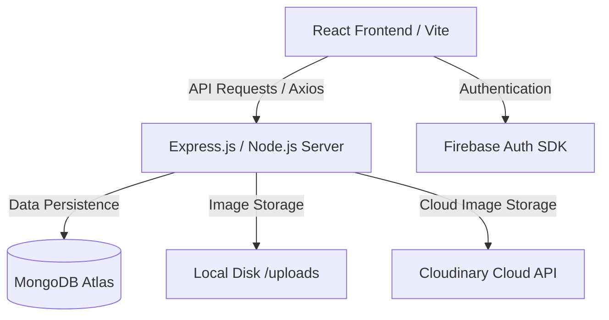

# Aesthetic Tech Store — Technical Documentation & Defense Guide

Welcome to the comprehensive technical documentation and academic defense guide for **Aesthetic Tech Store**, a MERN-stack e-commerce platform built for the **CSE-21** cohort (**BUS 4101** course). 

This document outlines the system architecture, database design, key features, setup steps, and covers all potential questions you could be asked during your project defense/viva.

---

## 📖 Table of Contents
1. [System Architecture](#-system-architecture)
2. [Database Schema & Models](#-database-schema--models)
3. [Key Feature Implementations](#-key-feature-implementations)
4. [Deployment Details](#-deployment-details)
5. [🎓 Academic Defense & Viva Q&A](#-academic-defense--viva-qa)
6. [🛠 Setup & Run Guide](#-setup--run-guide)

---

## 🏗 System Architecture

The project is structured as a decoupled full-stack application:



### 1. Frontend (`client/`)
* **Core:** React, Vite (Build Tool), Tailwind CSS (Aesthetic Dark UI).
* **State Management:** Redux Toolkit (`@reduxjs/toolkit` and `react-redux`) for managing:
  * Global Authentication state (`authSlice.js`).
  * Shopping Cart state (`cartSlice.js`).
* **Authentication:** Firebase Client SDK for Register/Login, providing secure social/password authentication.
* **Routing:** React Router DOM (`react-router-dom`) with layout-based routing and Protected Routes (User vs. Admin dashboards).

### 2. Backend (`server/`)
* **Core:** Node.js, Express.js (REST API framework).
* **Database Object Modeling:** Mongoose for MongoDB schema modeling, queries, and validation.
* **Authentication Middleware:** JWT (JSON Web Tokens) verification middleware for route protection. It decodes the custom JWT token issued by the backend after matching Firebase user profiles.
* **Image Management:** `multer` with dual-mode storage (Cloudinary wrapper or Local uploads fallback).
* **Email Dispatcher:** `nodemailer` for processing automatic notification emails (order status, refund notifications, etc.).

---

## 🗃 Database Schema & Models

Here is how the data structures are designed in MongoDB (located in `server/models/`):

### 1. User Model (`User.js`)
Stores user profiles, access credentials, and MegaCoin loyalty balances.
* `firebaseUid` (String, Unique): Links the MongoDB user record to the Firebase Auth profile.
* `name` (String, Required)
* `email` (String, Required, Unique, Lowercase)
* `password` (String, Optional): Kept for legacy users who do not register via Firebase.
* `role` (String): Enum `['user', 'admin']`, defaults to `'user'`.
* `megaCoinBalance` (Number): Defaults to `0`. Accumulates rewards.
* `addresses` (Array of objects): Embedded address sub-documents (fullName, phone, address, city, district, postalCode, isDefault).
* `isActive` (Boolean): Used for banning/unbanning users.

### 2. Product Model (`Product.js`)
Manages the hardware inventory and policy configurations.
* `name`, `slug`, `category`, `brand`, `model`, `description`.
* `images`: Array of `{ url, publicId }` objects.
* `configuration`: Array of `{ key, value }` pairs (e.g. `RAM: 16GB`).
* `guarantee`: Object `{ duration (Number), unit (Enum), terms (String) }`.
* `warranty`: Object `{ duration (Number), unit (Enum), terms (String) }`.
* `regularPrice` (Number), `discountPrice` (Number).
* `stock` (Number): Current inventory level.
* `sku` (String): Stock Keeping Unit.
* `megaCoinRewardRate` (Number): Custom reward rate override.
* `returnPolicy`: Object `{ eligible (Boolean), windowDays (Number), conditions (String) }`.
* `tags`: Array of strings for search/filtering.

### 3. Order Model (`Order.js`)
Tracks checkout details and payment flows.
* `user` (ObjectId, ref: User)
* `orderItems`: Array of objects (`product`, `name`, `quantity`, `price`, `image`).
* `shippingAddress`: Embedded shipping details object.
* `paymentMethod`: Enum `['cod', 'card']` (lowercase forced).
* `paymentStatus`: Enum `['pending', 'paid', 'failed', 'refunded']`.
* `orderStatus`: Enum `['pending', 'processing', 'shipped', 'delivered', 'cancelled', 'returned']`.
* `itemsPrice`, `taxPrice`, `shippingPrice`, `discountAmount` (Coupon), `megaCoinDiscount`, `totalAmount`.
* `megaCoinsEarned` (Number): Coins awarded for this order.
* `megaCoinsRedeemed` (Number): Coins spent to discount this order.
* `timeline`: Array of status updates with timestamps.

### 4. Return Request Model (`ReturnRequest.js`)
Handles post-delivery returns and refunds.
* `order` (ObjectId, ref: Order)
* `user` (ObjectId, ref: User)
* `items`: Array of returned items containing `{ product, name, quantity, price }`.
* `reason` (String): Enum of refund reasons.
* `reasonDetail` (String): Customer explanation.
* `evidence` (Array of Strings): Paths or URLs to uploaded evidence images.
* `refundMethod` (String): Enum `['original-payment', 'megacoin']`.
* `refundAmount` (Number): Final Taka amount refunded.
* `status` (String): Enum `['requested', 'under-review', 'approved', 'rejected', 'refunded']`.

### 5. MegaCoin Transaction Model (`MegaCoinTransaction.js`)
A ledger tracking all changes to any user's loyalty coin balance.
* `user` (ObjectId, ref: User)
* `type` (String): Enum `['earn', 'redeem', 'admin-credit', 'admin-deduct', 'refund-credit', 'refund-deduct']`.
* `amount` (Number): Positive for credit, negative for debit.
* `balance` (Number): Balance AFTER the transaction.
* `description` (String).

---

## 🚀 Key Feature Implementations

### 1. Dual-Mode Image Upload Fallback
When Cloudinary credentials are not configured in the `.env` file, the server does not crash. It automatically falls back to storing files locally in `server/uploads/` using `multer.diskStorage` and serves them statically:
* **Production/Cloudinary:** Uploads to Cloudinary API and saves absolute CDN urls.
* **Development/Local:** Saves files in the `uploads/` folder and generates urls like `http://localhost:5001/uploads/filename.png` dynamically.

### 2. Multi-Step Return Request & Stock Management
* Users can select specific items from a `delivered` order to return.
* Upload evidence photos (handled via multer upload).
* When the admin changes the return status to `'refunded'`:
  1. The parent order status changes to `'returned'`.
  2. The returned product quantity is **added back** to the product's `stock` database field.
  3. The MegaCoins the user originally earned for buying those items are **deducted** from their balance, and a `refund-deduct` transaction ledger is logged.

### 3. Dynamic CORS Origin Policy
To support multi-client environments (e.g. running the React app locally on port `5173` and deploying to Firebase Hosting under `.web.app` or `.firebaseapp.com`), the backend server uses a dynamic whitelist checks:
```javascript
const allowedOrigins = [
  'http://localhost:5173',
  'https://aesthetic-tech-store.web.app',
  'https://aesthetic-tech-store.firebaseapp.com'
];
```
This prevents CORS policy blocks on standard cross-origin requests.

---

## 🌐 Deployment Details

1. **Backend Server:** Deployed on **Render** at [https://aesthetic-tech-api.onrender.com](https://aesthetic-tech-api.onrender.com).
2. **Frontend Client:** Deployed on **Firebase Hosting** at [https://aesthetic-tech-store.web.app](https://aesthetic-tech-store.web.app).
3. **Environment Syncing:**
   * Local: Frontend requests local backend at `http://localhost:5001/api`.
   * Production: Frontend requests Render API at `https://aesthetic-tech-api.onrender.com/api`.

---

## 🎓 Academic Defense & Viva Q&A

Here are the most common questions professors ask during project defenses and how to answer them:

### Q1: What is the MERN Stack, and why did you choose it?
**Answer:** MERN stands for MongoDB, Express.js, React, and Node.js. 
* **React** handles a highly interactive, fast client interface (SPA) using virtual DOM.
* **Node.js & Express** form the backend runtime and API routing, which is event-driven and non-blocking, perfect for I/O operations.
* **MongoDB** is a NoSQL document database. Using JSON-like BSON documents makes it easy to work with data structures since we don't need complex JOIN operations; we can store nested objects (like cart items or addresses) directly inside a single document.

---

### Q2: Why did you combine Firebase Auth with MongoDB? Why not just use MongoDB or just Firebase?
**Answer:** We used **Firebase Auth** because it provides industry-standard, secure user authentication (handling password encryption, OAuth login, account recovery, session tokens, security rules) out of the box. 
However, for an e-commerce platform, we need to associate user profiles with custom shop logic (loyalty MegaCoins, shopping carts, checkout addresses, return requests). To do this, when a user registers or logs in, we retrieve their unique `firebaseUid` and map it to a user document inside our **MongoDB** database. This gives us the security of Firebase alongside the database query flexibility of MongoDB.

---

### Q3: Explain how JWT (JSON Web Tokens) works in your project.
**Answer:** When the user logs in, the backend issues an Access Token (short-lived, 15 minutes) and a Refresh Token (long-lived, 7 days).
1. The client saves the Access Token in memory/localStorage and attaches it to the `Authorization` header (`Bearer <token>`) for all private requests.
2. The backend verify middleware decodes the token using a secret key (`JWT_ACCESS_SECRET`) to identify the user (`req.user = user`).
3. If the Access Token expires, Axios interceptors intercept the `401 Unauthorized` response, send a POST request with the Refresh Token to `/api/auth/refresh`, receive a new Access Token, and retry the original request. This provides a seamless user experience.

---

### Q4: How is the MegaCoin reward system designed?
**Answer:** The MegaCoin system is a transactional loyalty model:
* **Earning:** When placing an order, users earn coins proportionally to the final price (e.g. spend ৳10 = earn 1 coin).
* **Redeeming:** At checkout, users can use a slider to redeem coins as a cash discount (e.g. 10 coins = ৳1 off).
* **Ledger Consistency:** To prevent race conditions or balance tampering, every change to a user's coin balance writes a record to the `MegaCoinTransaction` collection. The balance is never updated without a corresponding transaction log.

---

### Q5: What happens to inventory stock and MegaCoins when a product is returned/refunded?
**Answer:** This is a key transactional integrity feature:
1. **Stock Refilling:** When the admin approves a return request and updates the status to `refunded`, we loop through the returned items and increment the product's `stock` field by the returned quantity.
2. **Coin Clawback:** The user originally earned MegaCoins when buying the product. Upon refund, we calculate the original value of the returned item, calculate the coins earned on that value, deduct those coins from the user's `megaCoinBalance`, and write a `refund-deduct` transaction record.

---

### Q6: How does the application prevent CORS (Cross-Origin Resource Sharing) issues?
**Answer:** Browsers prevent web applications from making requests to a different domain than the one that served the web page, unless the target server explicitly permits it.
We configured the backend using the Node `cors` package with a whitelist of permitted domains:
* `http://localhost:5173` (local development)
* `https://aesthetic-tech-store.web.app` (Firebase deployment)
* `https://aesthetic-tech-store.firebaseapp.com` (Firebase fallback)
If a request origin matches one of these, the backend replies with the `Access-Control-Allow-Origin` header matching the client's domain.

---

### Q7: What security measures are implemented in your backend?
**Answer:**
* **Bcrypt hashing:** Any password in the local MongoDB schema is encrypted using a salt factor of 10.
* **JWT Access Restrictions:** Private routes require verified JWT tokens; admin routes verify `req.user.role === 'admin'`.
* **Input Sanitization:** Express parses body inputs, and Mongoose schema validations prevent database injection or invalid document formats.
* **CORS Whitelist:** Blocks unauthorized third-party scripts from fetching data from our endpoints.

---

## 🛠 Setup & Run Guide

### Prerequisities
Make sure you have **Node.js** and **Git** installed.

### 1. Clone the project
```bash
git clone https://github.com/mostafa-cse/Aesthetic-Tech-Store.git
cd Aesthetic-Tech-Store
```

### 2. Install all dependencies
```bash
# Installs backend and frontend dependencies automatically
npm run install:all
```

### 3. Setup Environment Variables
Create a `.env` file in the `server/` directory:
```env
PORT=5001
NODE_ENV=development
MONGO_URI=your_mongodb_connection_string
JWT_ACCESS_SECRET=your_secret_access_key
JWT_REFRESH_SECRET=your_secret_refresh_key
JWT_ACCESS_EXPIRE=15m
JWT_REFRESH_EXPIRE=7d
CLIENT_URL=http://localhost:5173
```

Create a `.env` file in the `client/` directory:
```env
VITE_API_URL=http://localhost:5001/api
```

### 4. Run the project locally
In the root directory, run:
```bash
# Starts the backend on http://localhost:5001
npm run dev:server

# Starts the frontend on http://localhost:5173
npm run dev:client
```

---
*Documentation prepared for CSE-21 Class Projects Presentation. Good luck with your defense!*
